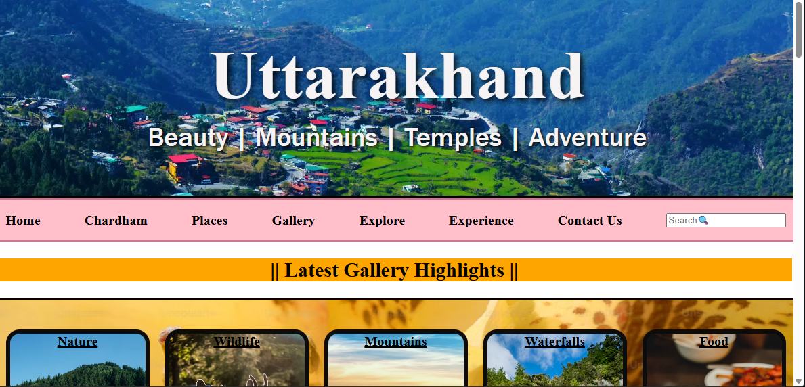

# 🏔️ Uttarakhand Tourism

A tourism website showcasing the beauty, culture, spirituality, and popular destinations of Uttarakhand. Built using HTML and CSS as part of my web development learning journey.

## ✨ Features

* Hero section with Uttarakhand theme
* Explore Uttarakhand section
* Experience the Best of Devbhoomi section
* Char Dham Yatra information
* Sacred Temples of Uttarakhand
* Popular Destinations
* Gallery Highlights
* Smooth scrolling navigation
* Interactive hover effects
* Footer section

## 🛠️ Technologies Used

* HTML5
* CSS3

## 📂 Project Structure

uttarakhand-tourism/

├── index.html

├── style.css

├── images/

└── README.md

## 🚀 How to Run

1. Download or clone the repository.
2. Open the project folder.
3. Open `home.html` in your browser.

## 📸 Screenshots

## Future Improvements

- Add dark mode
- Improve responsiveness
- Add search functionality

## 👨‍💻 Author

**Amrita Soni**

Incoming CS-AI Student | Aspiring Web Developer
